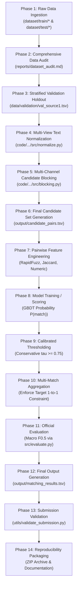

# Amazon ML Challenge 2026: ML Pipeline Execution Flow

**Document Path:** `docs/app-flow.md`  
**Pipeline Type:** Batch / Offline Machine Learning Pipeline  
**Status:** ACTIVE  

---

### End-to-End Pipeline Execution Flow

There is no interactive user-facing application in this project. The system operates as a deterministic, batch-oriented machine learning execution pipeline.

---

### Stage-by-Stage Operational Walkthrough

| Stage | Input Artifacts | Processing Logic | Output Artifacts | Primary Quality Gate |
| :--- | :--- | :--- | :--- | :--- |
| **1. Ingestion** | Raw TSVs in `dataset/` | Streamed tab-delimited parsing with string dtypes | Raw DataFrames | Column check, null check |
| **2. Audit** | Raw DataFrames | Lineage, cardinality, country overlap, duplicate metrics | `reports/dataset_audit.md` | Verification of 100% country conservation |
| **3. Validation** | `train_source1.tsv`, GT | Stratified sampling by country and match count | `data/validation/` | Exact match to population distributions |
| **4. Normalization** | Raw text fields | Accent stripping, digit separation, legal suffix cleaning | Multi-view token dictionaries | Preservation of original strings |
| **5. Blocking** | Normalized records | Inverted indexing across 7 complementary channels | Candidate pair mapping | Candidate recall $\ge 85\%$, cands/S1 $\le 120$ |
| **6. Candidates** | Blocker output | Formatting and persistence | `output/candidate_pairs.tsv` | Matches required TSV contract |
| **7. Features** | Candidate pairs | Vectorized string distance, numeric equality, token overlap | Feature matrix $\mathbf{X} \in \mathbb{R}^{M \times D}$ | Absence of NaNs / infinities |
| **8. Scoring** | Feature matrix | GBDT binary classification | Predicted probabilities $p \in [0, 1]$ | ROC-AUC, Log-Loss convergence |
| **9. Threshold** | Predicted probabilities | Selection of optimal probability cutoff | Filtered pair set | Maximization of Macro $F_{0.5}$ |
| **10. Post-Process** | Filtered pairs | Disjoint assignment (max 1 S1 per target) | Cleaned predictions | Target duplicate check |
| **11. Evaluation** | Cleaned predictions, GT | Entity-level macro evaluation with singleton rules | Macro $F_{0.5}$, Precision, Recall | Macro $F_{0.5} \ge 0.70$ |
| **12. Export** | Predictions | Format to tab-separated ID lists | `output/matching_results.tsv` | Exact test $S1$ row count |
| **13. Validation** | Output files, test sources | Run `utils/validate_submission.py` | Terminal validation report | **PASS (Exit Code 0)** |
| **14. Packaging** | Outputs, code, docs | Package ZIP archive with requirements and README | `<team_name>_submission.zip` | Verification of unzipped execution |
