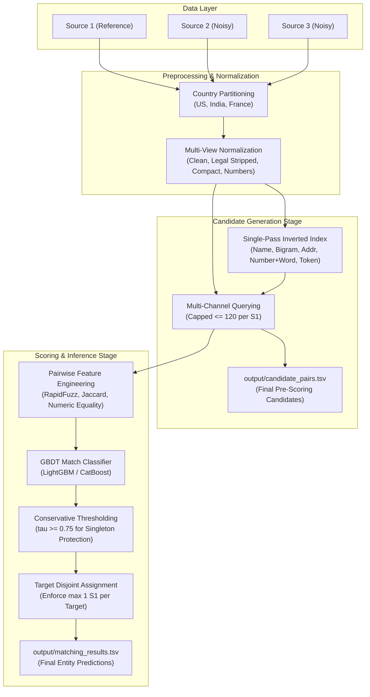

# Amazon ML Challenge 2026: System & ML Architecture

**Document Path:** `docs/architecture.md`  
**Status:** ACTIVE  

---

### 1. Architectural Overview

The Business Entity Resolution system is architected as an offline, high-throughput, multi-stage funnel designed to scale across tens of millions of records while strictly controlling precision under the macro $F_{0.5}$ metric.

---

### 2. Detailed Execution Paths

The architecture bifurcates cleanly into three distinct execution modes:

#### Path A: Training Path (Full Ground Truth Active)
* **Inputs:** `train_source1.tsv`, `train_source2.tsv`, `train_source3.tsv`, `train_ground_truth.tsv`.
* **Execution Flow:**
  1. Multi-channel candidate blocker indexes $S2$ and $S3$.
  2. Queries candidates for training $S1$ entities.
  3. Joins candidate pairs against `train_ground_truth.tsv` to assign binary labels:
     $$y(S1, T) = \begin{cases} 1 & \text{if } T \in \text{GT}(S1) \\ 0 & \text{otherwise} \end{cases}$$
  4. Generates pairwise similarity features.
  5. Subsamples negative candidate pairs (to maintain manageable memory and class balance).
  6. Trains the GBDT classifier and persists the model artifact to `models/gbdt_matcher.bin`.

#### Path B: Validation Path (Holdout Simulation)
* **Inputs:** `data/validation/val_source1.tsv` (30,000 $S1$), full train $S2$ and $S3$, `data/validation/val_ground_truth.json`.
* **Execution Flow:**
  1. Indexes target records ($S2 + S3$) for validation.
  2. Queries candidate sets for validation $S1$ entities.
  3. Computes candidate recall and reduction ratio.
  4. Runs pairwise feature extraction and model inference.
  5. Evaluates threshold grid $\tau \in [0.50, 0.95]$ using `src/evaluate.py`.
  6. Reports official macro $F_{0.5}$, singleton accuracy, precision, and recall.
  7. Identifies false positives and false negatives for error analysis.

#### Path C: Test Inference Path (Ground Truth Absent)
* **Inputs:** `dataset/test/test_source1.tsv`, `dataset/test/test_source2.tsv`, `dataset/test/test_source3.tsv`.
* **Execution Flow:**
  1. Partitions test data into `US`, `India`, and `France`.
  2. Builds target inverted indexes for test $S2$ and $S3$ per country.
  3. Generates candidate sets for all 1,732,544 test $S1$ entities.
  4. Exports `output/candidate_pairs.tsv` (**Mandatory Artifact 1**).
  5. Computes pairwise features for candidate pairs.
  6. Evaluates model probabilities $P(\text{match} \mid \mathbf{x})$.
  7. Applies optimal validation threshold $\tau^*$.
  8. Enforces target uniqueness post-processing constraint.
  9. Exports `output/matching_results.tsv` (**Mandatory Artifact 2**).
  10. Executes `utils/validate_submission.py` to confirm zero formatting errors.

---

### 3. Data Integrity & Candidate Consistency Invariant

A central competition requirement is that **every matched record in `matching_results.tsv` must be present in `candidate_pairs.tsv`**:

$$\text{Matched}(S1_i) \subseteq \text{Candidates}(S1_i) \quad \forall i$$

In our architecture, this is structurally guaranteed:
1. `candidate_pairs.tsv` is generated directly from the final output of the blocker immediately before pairwise feature extraction.
2. The ML classifier only scores pairs that exist in `candidate_pairs.tsv`.
3. Matched pairs are filtered strictly as a subset of the scored candidate set.
4. An entity prediction outside the candidate set is mathematically impossible under this data flow.

---

### 4. Country Partitioning Isolation

Ground truth empirical analysis established **100.000% country conservation** across 7,638,365 true pairs:
$$\forall (S1, T) \in \text{GroundTruth}, \quad \text{Country}(S1) = \text{Country}(T)$$

The architecture enforces an isolated, embarrassingly parallel processing structure:
* Worker 1 processes `India` ($S1_{\text{IN}} \times (S2_{\text{IN}} + S3_{\text{IN}})$).
* Worker 2 processes `US` ($S1_{\text{US}} \times (S2_{\text{US}} + S3_{\text{US}})$).
* Worker 3 processes `France` ($S1_{\text{FR}} \times (S2_{\text{FR}} + S3_{\text{FR}})$).

This architecture eliminates 61% of theoretical pair combinations before string processing begins and allows each country partition to fit comfortably within 4 GB of RAM.
