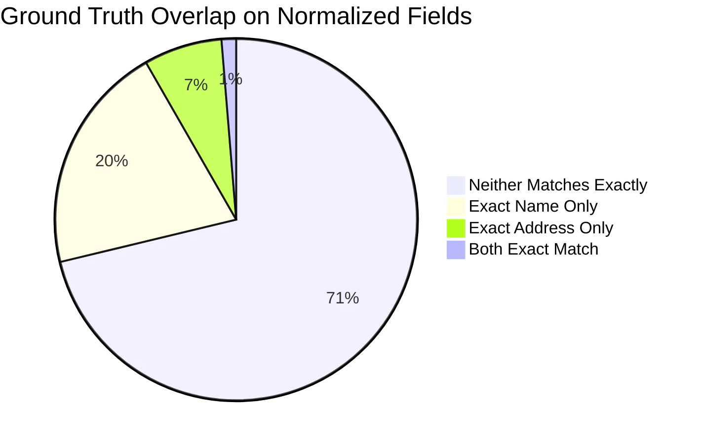

# Amazon ML Challenge 2026: Business Entity Resolution
## Comprehensive Dataset Autopsy & Audit Report

**Report Location:** `reports/dataset_audit.md`  
**Execution Date:** 2026-09-25  
**Evaluation Target:** Macro $F_{0.5}$ across all test Source 1 entities  

---

### Executive Overview & Critical Findings

1. **Exhaustive Scale is Impossible ($10^{13}$ Pairs):**
   - Exhaustive pairwise generation for Train $S1 \times (S2 + S3) \approx \mathbf{22.77 \text{ Trillion}}$ candidate pairs.
   - For Test $S1 \times (S2 + S3) \approx \mathbf{17.27 \text{ Trillion}}$ candidate pairs.
   - Multi-stage indexed blocking is computationally mandatory.
2. **Country is a 100.00% Exact Partition:**
   - Evaluated across all **7,638,365 ground-truth pairs**: **0 country mismatches (100.000% consistency)**.
   - True matches *never* cross international borders. Country acts as an absolute hard filter (zero recall penalty).
3. **Exact Matching Misses 71.24% of Matches:**
   - Only 4.63% of true pairs share exact raw names; only 21.77% share exact normalized names.
   - Only 2.24% share exact raw addresses; only 8.29% share exact normalized addresses.
   - **71.24% of true matches match NEITHER exact normalized name NOR exact normalized address.** Naive exact blocking will cause a catastrophic ~71% false negative rate.
4. **Singletons and Distractors:**
   - **5.58% (123,247 entities)** of S1 entities are true singletons (0 matches).
   - In Train, **26.6% of S2** and **25.4% of S3** records are unlinked distractors/noise that belong to no S1 entity.
   - S2 and S3 targets are strictly partitioned: **no S2 or S3 entity links to more than one S1 entity** (`max_s1_per_target = 1`).
5. **Significant Test Distribution Shift:**
   - Train country mix: **59.98% US**, **40.02% India**.
   - Test country mix: **46.75% India**, **38.27% US**, **14.98% France** (open-set country).
   - India is the plurality country in Test, and France is entirely unseen in Train.

---

### 1. Dataset Scale, Memory & Schema

| Dataset Split | Source File | Records | File Size | Memory Footprint (Deep) | Dtypes |
| :--- | :--- | :--- | :--- | :--- | :--- |
| **Train** | `train_source1.tsv` | 2,206,821 | 200.34 MB | 604.43 MB | 4 object (string) |
| **Train** | `train_source2.tsv` | 5,034,616 | 466.63 MB | 1,418.80 MB | 4 object (string) |
| **Train** | `train_source3.tsv` | 5,285,603 | 480.37 MB | 1,478.47 MB | 4 object (string) |
| **Train** | `train_ground_truth.tsv` | 2,206,821 | 121.13 MB | ~350 MB | 2 object (string) |
| **Test** | `test_source1.tsv` | 1,732,544 | 166.91 MB | 485.89 MB | 4 object (string) |
| **Test** | `test_source2.tsv` | 4,887,273 | 485.86 MB | 1,419.78 MB | 4 object (string) |
| **Test** | `test_source3.tsv` | 5,082,316 | 482.56 MB | 1,452.44 MB | 4 object (string) |
| **Total Sources** | **6 Source TSVs** | **24,229,173** | **2,282.67 MB** | **6.86 GB** | - |

**Columns:**
- Source files: `['entity_id', 'business_name', 'business_address', 'country']`
- Ground truth file: `['source1_entity_id', 'matched_entity_ids']`

---

### 2. Missingness and Completeness

| Split | Source | Missing `entity_id` | Missing `business_name` | Missing `business_address` | Missing `country` |
| :--- | :--- | :--- | :--- | :--- | :--- |
| **Train** | S1 | 0 (0.00%) | 0 (0.00%) | 0 (0.00%) | 0 (0.00%) |
| **Train** | S2 | 0 (0.00%) | 2 (0.00004%) | 168,967 (3.356%) | 0 (0.00%) |
| **Train** | S3 | 0 (0.00%) | 13 (0.00025%) | 175,916 (3.328%) | 0 (0.00%) |
| **Test** | S1 | 0 (0.00%) | 0 (0.00%) | 0 (0.00%) | 0 (0.00%) |
| **Test** | S2 | 0 (0.00%) | 46 (0.00094%) | 129,408 (2.648%) | 0 (0.00%) |
| **Test** | S3 | 0 (0.00%) | 59 (0.00116%) | 136,098 (2.678%) | 0 (0.00%) |

**Key Insight:** S1 has zero missing fields. S2 and S3 have approximately 2.6% to 3.4% entirely missing addresses (`NaN`). Blocking methods that rely strictly on address will lose 100% of matches for these entities; complementary name-based blocking paths are mandatory.

---

### 3. Entity Uniqueness & Duplication Analysis

| Split | Source | Unique `entity_id` | Dup IDs | Unique Names | Dup Names | Unique Addrs | Dup Addrs | Content Dupes $(N, A, C)$ |
| :--- | :--- | :--- | :--- | :--- | :--- | :--- | :--- | :--- |
| **Train** | S1 | 2,206,821 | 0 | 1,539,229 | 667,592 | 2,130,606 | 76,215 | **0** |
| **Train** | S2 | 5,034,616 | 0 | 4,402,008 | 632,608 | 4,337,261 | 697,355 | 25,873 |
| **Train** | S3 | 5,285,603 | 0 | 4,651,608 | 633,995 | 4,632,764 | 652,839 | 18,860 |
| **Test** | S1 | 1,732,544 | 0 | 1,238,867 | 493,677 | 1,677,483 | 55,061 | **0** |
| **Test** | S2 | 4,887,273 | 0 | 4,311,040 | 576,233 | 4,224,783 | 662,490 | 22,641 |
| **Test** | S3 | 5,082,316 | 0 | 4,521,928 | 560,388 | 4,456,435 | 625,881 | 16,293 |

- **ID Integrity:** Zero duplicate `entity_id`s exist in any file. ID prefixes strictly match file sources (`S1-`, `S2-`, `S3-`).
- **S1 Deduplication Guarantee:** S1 is 100% deduplicated across $(N, A, C)$ combinations.
- **Name Ambiguity:** Common medical/corporate entity names (e.g., *"Primary Care Group"*, *"Physical Therapy"*, *"Urgent Care"*) appear hundreds of times at different addresses. A matching model must rely on cross-field joint evidence rather than isolated name similarity.

---

### 4. Country Distribution & Covariate Shift

| Source | United States (US) | India (India) | France (France) |
| :--- | :--- | :--- | :--- |
| **Train S1** | 1,323,633 (59.98%) | 883,188 (40.02%) | 0 (0.00%) |
| **Train S2** | 3,016,817 (59.92%) | 2,017,799 (40.08%) | 0 (0.00%) |
| **Train S3** | 3,170,056 (59.98%) | 2,115,547 (40.02%) | 0 (0.00%) |
| **Test S1** | 663,106 (38.27%) | 809,986 (46.75%) | 259,452 (14.98%) |
| **Test S2** | 1,871,330 (38.29%) | 2,312,565 (47.32%) | 703,378 (14.39%) |
| **Test S3** | 1,945,701 (38.28%) | 2,405,000 (47.32%) | 731,615 (14.40%) |

**Covariate Shift Takeaways:**
1. Train is predominantly US (60%), whereas Test is predominantly India (47%) and contains a new market, France (15%).
2. Normalization and address parsing must be country-adaptive or language-agnostic (handling French street markers like `Rue`, `Boulevard`, `Avenue`, `SARL`, `SAS`).
3. Models must generalize across unseen geographic and corporate naming conventions without overfitting to US-specific patterns.

---

### 5. String Length Distributions

| Dataset Split | Field | Min | P25 | Median | Mean | P75 | P95 | P99 | Max | Length $\le 2$ |
| :--- | :--- | :--- | :--- | :--- | :--- | :--- | :--- | :--- | :--- | :--- |
| **Train S1** | Name | 3 | 18 | 24 | 24.03 | 30 | 37 | 42 | 105 | 0 |
| **Train S1** | Address | 11 | 33 | 41 | 52.07 | 70 | 103 | 124 | 256 | 0 |
| **Train S2** | Name | 0 | 19 | 25 | 25.10 | 31 | 40 | 48 | 104 | 704 |
| **Train S2** | Address | 0 | 30 | 37 | 46.23 | 61 | 96 | 118 | 249 | 168,967 |
| **Train S3** | Name | 0 | 18 | 25 | 25.20 | 31 | 42 | 50 | 123 | 9,275 |
| **Train S3** | Address | 0 | 35 | 42 | 46.71 | 54 | 91 | 115 | 240 | 175,930 |
| **Test S1** | Name | 3 | 18 | 24 | 23.84 | 29 | 36 | 42 | 92 | 0 |
| **Test S1** | Address | 11 | 36 | 50 | 57.21 | 74 | 105 | 126 | 268 | 0 |
| **Test S2** | Name | 0 | 19 | 25 | 25.70 | 32 | 42 | 49 | 102 | 10,166 |
| **Test S2** | Address | 0 | 32 | 43 | 50.41 | 67 | 99 | 120 | 269 | 129,413 |
| **Test S3** | Name | 0 | 19 | 25 | 25.66 | 32 | 42 | 50 | 103 | 19,910 |
| **Test S3** | Address | 0 | 35 | 43 | 48.74 | 59 | 94 | 117 | 267 | 136,145 |

**Observations:**
- Names average ~24 to 26 characters. Addresses average ~46 to 57 characters.
- In S2 and S3, abbreviations and acronyms are common: tens of thousands of records have names $\le 2$ characters (e.g., `CC`, `PC`, `AC`, `SC`).

---

### 6. Ground-Truth Match & Singleton Structure

- **Total S1 Entities in GT:** 2,206,821 (100% coverage of S1)
- **Total True Pairs:** 7,638,365
- **Mean Matches per S1:** 3.4613 (Median: 3.0, Max: 11)
- **Singletons (0 matches):** **123,247 entities (5.5848%)**

#### Distribution of Matches per S1 Entity

| Match Count | S1 Count | Percentage | Cumulative % |
| :---: | :---: | :---: | :---: |
| **0 (Singleton)** | 123,247 | 5.585% | 5.585% |
| **1** | 119,157 | 5.399% | 10.984% |
| **2** | 375,212 | 17.002% | 27.986% |
| **3** | 530,841 | 24.055% | 52.041% |
| **4** | 484,115 | 21.937% | 73.978% |
| **5** | 321,957 | 14.589% | 88.567% |
| **6** | 164,868 | 7.471% | 96.038% |
| **7** | 63,968 | 2.899% | 98.937% |
| **8** | 18,680 | 0.846% | 99.783% |
| **9** | 4,205 | 0.191% | 99.974% |
| **10** | 534 | 0.024% | 99.998% |
| **11** | 37 | 0.002% | 100.000% |

#### Cross-Source Linkage Breakdown

| Source Combination | S1 Entities | Percentage |
| :--- | :--- | :--- |
| **Matches Both S2 and S3** | 1,776,047 | 80.48% |
| **Matches Only S3** | 164,498 | 7.45% |
| **Matches Only S2** | 143,029 | 6.48% |
| **Singletons (Neither S2 nor S3)** | 123,247 | 5.58% |

#### S2 and S3 Partitioning Property

| Metric | Source 2 | Source 3 |
| :--- | :--- | :--- |
| **Total Records in Train** | 5,034,616 | 5,285,603 |
| **Records Matched to S1 in GT** | 3,693,619 (73.36%) | 3,944,746 (74.63%) |
| **Unmatched Distractor Records** | 1,340,997 (26.64%) | 1,340,857 (25.37%) |
| **Max S1 Matches per S2/S3 Target** | **1** | **1** |
| **Targets Linked to $>1$ S1** | **0 (0.00%)** | **0 (0.00%)** |

**Crucial Invariant:** Every S2 and S3 record matches *at most one* S1 record. This strict disjoint property confirms that predictions can enforce 1-to-1 matching from the target side (an S2 or S3 ID should never be assigned to two different S1 entities).

---

### 7. Overlap and String Similarity Analysis

Evaluated across **7,638,365 ground-truth pairs**:

| Overlap Metric | True Pair Proportion |
| :--- | :---: |
| **Country Match Rate** | **100.000% (0 mismatches across 7.64M pairs)** |
| **Exact Raw Business Name Match** | 4.63% |
| **Exact Normalized Business Name Match** | 21.77% |
| **Exact Raw Business Address Match** | 2.24% |
| **Exact Normalized Business Address Match** | 8.29% |
| **Exact Normalized BOTH (Name AND Address)** | 1.30% |
| **Exact Normalized NEITHER (Neither Name nor Addr)** | **71.24%** |

---

### 8. Noise Patterns & Data Generation Artifacts

Direct inspection of ground-truth matches reveals five distinct noise injection mechanisms:
1. **Character-level Typos and Transpositions:**
   - Name: `Maure Williams Colombier Inc` $\rightarrow$ `Maure Wilblims Colombier Inc`
   - Address: `85 Wayne Avenue, Ticonderoga, NY` $\rightarrow$ `85 Wanye Avenue, Ticonderoga Townshiip, New York`
2. **Domain/URL Name Transmutation:**
   - Name transformed to web domain: `maurewilliamscolombier.com`
3. **Severe Name Corruptions / DBAs:**
   - True match retains identical street address and city, but business name is replaced with noise or garbled tokens (e.g. `Drxkor`).
4. **Legal Suffix & Business Word Variations:**
   - Stripping or appending `Inc`, `LLP`, `Center`, `Group`, `SARL`, `SAS`.
5. **Acronymization:**
   - Names contracted into 2-letter acronyms (`Primary Care` $\rightarrow$ `PC`, `Community Center` $\rightarrow$ `CC`).
6. **Address Component Variations:**
   - State abbreviations (`NY` $\leftrightarrow$ `New York`, `MH` $\leftrightarrow$ `Maharashtra`).
   - Street abbreviations (`Avenue` $\leftrightarrow$ `Ave`, `Road` $\leftrightarrow$ `Rd`).
   - Landmark-based addresses in India (`Near SBI ATM`, `Opposite Railway Station`).

---

### 9. Dataset Scale & Theoretical Pair Combinations

Exhaustive Cartesian product $S1 \times (S2 + S3)$:

$$\text{Pairs}_{\text{exhaustive}} = |S1| \times (|S2| + |S3|)$$

| Split | $|S1|$ | $|S2| + |S3|$ | Exhaustive Pairs | Country-Blocked Pairs | Blocking Reduction Ratio |
| :--- | :--- | :--- | :--- | :--- | :--- |
| **Train** | 2,206,821 | 10,320,219 | **22,774,874,675,839 (~22.77 Trillion)** | **11,839,669,378,657 (~11.84 Trillion)** | 48.01% |
| **Test** | 1,732,544 | 9,969,589 | **17,272,750,917,416 (~17.27 Trillion)** | **6,724,569,535,212 (~6.72 Trillion)** | 61.07% |

**Why Blocking is Mandatory:**
- Country partitioning reduces the pair search space by ~48% to 61%, but leaves **6.72 Trillion test pairs**.
- At 1 microsecond per pair, scoring 6.72 trillion pairs would take **77.8 days** of continuous CPU execution.
- We must reach a candidate size of $\le 50$ to $100$ candidates per S1 entity ($\approx 85 \text{ to } 170 \text{ million}$ total candidate pairs), achieving a **$>99.998\%$ candidate reduction ratio** while maintaining **$>95\%$ candidate recall**.

---

### 10. Summary Table of Competition Variables

| Dimension | Measured Fact | Engineering Impact |
| :--- | :--- | :--- |
| **Evaluation Metric** | Macro $F_{0.5}$ (precision weighted $2\times$ over recall) | Conservative prediction thresholding; precision prioritized |
| **Singletons** | 5.58% in S1 | Singleton detection module; predict empty list confidently |
| **Target Partitioning** | $S2, S3$ targets match $\le 1$ $S1$ | Post-processing assignment constraint (disallow duplicate target claims) |
| **Noise Profile** | 71.24% of true pairs have neither exact name nor address | Multi-channel blocking (token, character n-gram, address numbers) |
| **Country Constraint** | 100.0% country consistency across all true pairs | Hard blocking key on `country`; partition entire pipeline by country |
| **Open-Set Test Country** | France present in Test (15%), absent in Train | Generic normalization, language-agnostic tokenizers, no country hard-coding |
